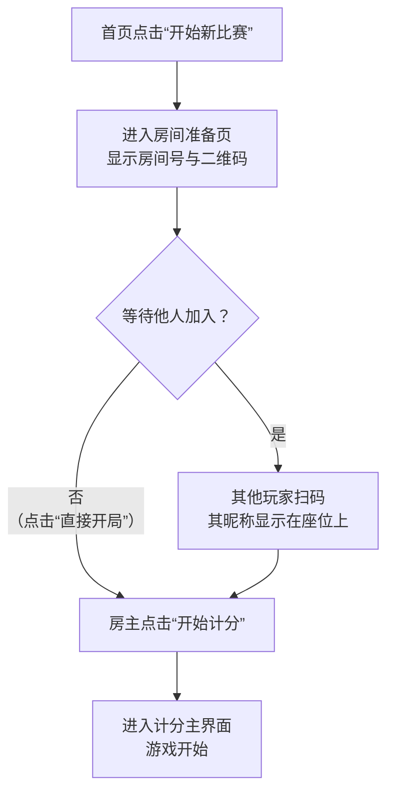
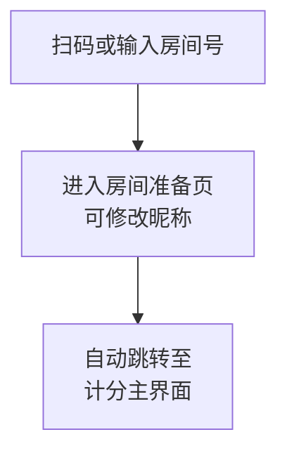
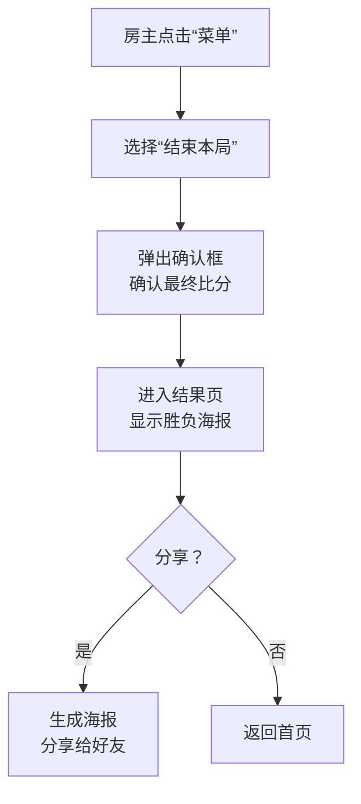

非常好，这些问题是从“能用”到“好用”的关键。我们将基于**低成本架构**，设计一套**清晰、直观、容错性强**的用户体验。

---

### **最佳用户体验设计**

#### **1. 界面布局设计**

**核心原则：信息层次清晰，核心操作触手可及。**

**a. 多人游戏主界面（计分页面）**

这是最核心的界面，设计目标是让所有人（包括操作手机的人和围观者）都能一眼看清局势。

| 区域 | 设计说明 | 备注 |
| :--- | :--- | :--- |
| **顶部状态栏** | 显示房间号 (`房间号：123456`)、当前轮次 (`第3轮`)。提供“菜单”按钮（三个点），用于触发“结束游戏”、“退出房间”等操作。 | **固定显示，关键信息一目了然。** |
| **中央比分牌** | **视觉焦点。** 采用大型数字显示两队当前比分，如 `5 : 3`。比分下方可显示小队标识（如“红队” vs “蓝队”）。当比分更新时，可以有轻微的放大缩小动画效果。 | **这是所有人最关心的核心数据。** |
| **玩家信息区** | 环绕在比分牌四周，清晰展示四位玩家的位置关系。 • 每个区域显示：玩家头像（或默认图标）、昵称。 • **房主**在昵称旁有特殊标识（如皇冠图标）。 • **当前操作者**（房主）的区域可以有高亮效果。 | 模拟真实的牌桌座位，符合用户心智模型。 |
| **计分操作区** | **底部固定栏。** 提供最常用的计分按钮。 • **主要按钮：** `红队+1分`， `蓝队+1分`。设计得最大、最醒目。 • **次级操作：** “更多”按钮，点击后展开菜单，提供`+2分`、`+3分`、`回退上一步`等不常用功能。 | 将高频操作极致简化，低频操作收纳起来，保持界面清爽。 |
| **历史记录流** | 在比分牌下方提供一个可滚动区域，以时间线形式列出每一步得分记录（例如：`10:01 红队 +1分 (头游)`）。 | 用于复盘和验证，增强可信度。 |

*(此处应有一张草图，上方是状态栏，中间是大比分和四个玩家位置，底部是计分按钮)*

---

#### **2. 操作流程：从创建到结束**

我们的目标是**步骤最少，指引明确**。

**流程一：房主创建并开局**

**流程二：玩家加入已有房间**

**流程三：结束与分享**

---

#### **3. 状态提示：让用户心中有数**

使用多种方式组合提示，避免用户困惑。

| 状态 | 提示方式 | 具体设计 |
| :--- | :--- | :--- |
| **等待加入** | **页面标题 + 视觉设计** | 准备页标题为“等待加入...”。空座位显示为虚位以待的灰色图标。 |
| **游戏中** | **动态元素 + 文字** | 计分页标题显示“计分中”。比分牌有轻微脉冲动画。历史记录流实时滚动。 |
| **网络连接中** | **全局轻提示** | 网络不稳定时，在页面顶部出现一条透明背景的提示条：“网络连接中...”，连接恢复后显示“已重新连接”。 |
| **数据同步** | **按钮状态 + 轻提示** | 房主点击得分按钮后，按钮立即变为`禁用状态`并显示“同步中...”，同步成功后恢复，并给出“得分成功”的轻提示（Toast）。其他玩家端通过轮询自动更新。 |
| **非实时同步** | **引导性文字** | 在计分页历史记录流附近，给出一行小字提示：“比分数据约每15秒自动更新”，并提供一个“手动刷新”按钮。 |

---

#### **4. 错误处理：优雅地应对问题**

错误处理的核心是**告知用户发生了什么、为什么发生、以及他们能做什么**。

| 错误场景 | 前端检测与处理 | 用户看到的反馈 |
| :--- | :--- | :--- |
| **网络异常** | 云函数调用失败，监听 `wx.onNetworkStatusChange`。 | 1. **Toast提示：** “网络开小差了，请检查网络设置。” 2. **界面变化：** 所有操作按钮变为不可点击状态。 3. **提供重试：** 显示一个“重试”按钮。 |
| **房间已满员** | 调用 `joinRoom` 云函数后，后端返回特定错误码。 | 显示一个友好的模态对话框（Modal）： **标题：** 无法加入 **内容：** 这个房间已经满员了（4/4），请联系房主获取新的房间信息。 **按钮：** “知道啦” （点击后返回首页）。 |
| **房间不存在或已结束** | 云函数返回错误码。 | 模态对话框： **标题：** 房间不存在 **内容：** 可能房间号错误，或比赛已经结束了。 **按钮：** “返回首页” |
| **操作冲突（非房主计分）** | 前端根据 `creatorOpenid` 判断，若非房主，则禁用计分按钮。 | 当非房主点击计分按钮时，给出 Toast 提示：“只有房主可以计分哦~”。 |
| **云函数调用频率超限** | 捕获特定错误码。 | Toast 提示：“操作太频繁啦，请稍候再试。” |

### **总结：最佳体验的秘诀**

1.  **预期管理：** 通过提示文字（如“非实时同步”）让用户知道会发生什么，降低预期，避免焦虑。
2.  **即时反馈：** 任何用户操作（点击、滑动）都应有视觉或触觉（如振动）反馈，即使是在网络请求中。
3.  **容错设计：** 允许用户犯错（如提供“回退上一步”功能），并提供清晰的恢复路径。
4.  **语言友好：** 使用口语化、幽默的提示语，如“网络开小差了”，而非生硬的“网络连接错误”。

通过以上设计，即使是在“低成本、非绝对实时”的架构下，也能为用户提供一个**流畅、安心、愉悦**的计分体验。