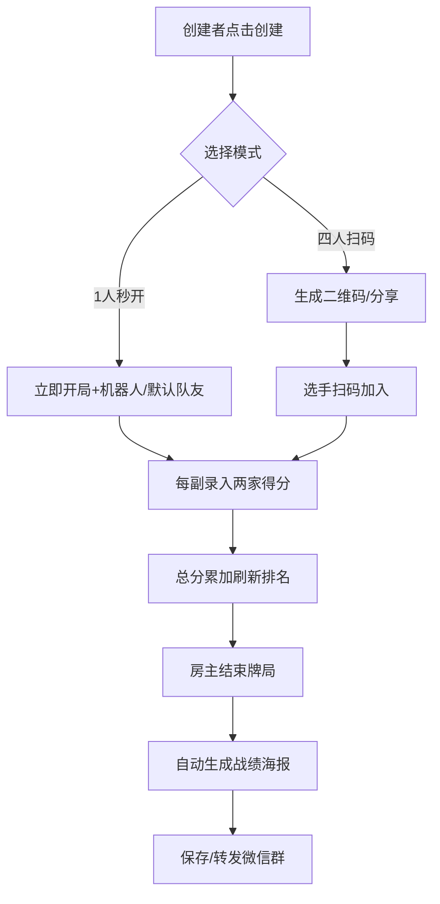

# 小程序「掼蛋计分扫码分享加入、队友数据绑定等功能」产品需求文档  
**正式版 | v3.1 | 2025-09-27**

---

## 1. 文档信息
| 项目 | 内容 |
| --- | --- |
| 产品名称 | 掼蛋计分 |
| 版本 | v3.1（正式版） |
| | 修订日期 | 2025-09-27 |
| 修订人 | — |

---

## 2. 版本变更
| 版本 | 日期 | 变更描述 |
| --- | --- | --- |
| 

---

## 3. 

---

## 4. 角色权限
| 角色 | 权限 |
| --- | --- |
| 创建者（房主） | 创建、分享、转让房主、结束牌局 |
| 普通选手 | 加入、录入得分、查看实时排名 |
| 机器人/默认队友 | 自动得分（平均分）或同队手动录入 |
| 系统 | 生成海报、数据持久化、候补推送 |

---

## 5. 核心流程


---

## 6. 功能需求（FR）
| 编号 | 功能 | 详细描述 |
| --- | --- | --- |
| FR01 | 灵活创建 | 支持四人扫码、1人秒开；秒开时选择空席策略：①机器人 ②默认队友名称 |
| FR02 | 扫码/分享加入 | 统一 join 页面，支持 scene & path；中途可加人 |
| FR03 | 候补补位 | 满员后进入队列，房主确认后补位；从当前副开始计分 |
| FR04 | 空席策略-机器人 | 得分=该局当前平均分，头像显示🤖 |
| FR05 | 空席策略-默认队友 | 头像显示「队友1」等，得分由同队选手录入 |
| FR06 | 录入得分 | 每副仅输入两家数字 → 保存即刷新总榜柱形图 |
| FR07 | 结束牌局 | 房主点击「结束」→ 生成战绩海报 → 保存/转发 |
| FR08 | 历史记录 | 个人中心日历列表，支持月份/对手搜索 |
| FR09 | 个人统计 | 总场次、胜率、平均得分、MVP 次数 |
| FR10 | 战绩海报 | 720×1280 图：总积分柱形图 + MVP + 小程序码 |

---

## 7. 主要页面
| 页面 | 内容 |
| --- | --- |
| 首页 | 创建牌局、最近3局、个人战绩卡片 |
| 创建弹窗 | 模式选择、空席策略开关 |
| 牌局大厅 | 座位+二维码+分享、实时总榜 |
| 记分面板 | 第N副、NS得分输入、EW得分输入、保存按钮 |
| 排名页 | 柱形图、结束按钮 |
| 历史 | 日历圆点、列表搜索 |
| 个人中心 | 统计数字、赛季海报按钮 |

---

## 8. 数据模型
**match**  
```json
{
  matchId: string,
  ownerId: string,
  status: string, // waiting|running|end
  createTime: Date,
  endTime: Date,
  robotFlag: boolean,
  mode: string // 4p|3p|2v2
}
```

**seat**  
```json
{
  matchId: string,
  seatNo: number,
  playerId: string, // robot_xxx 或 openid
  nick: string,
  avatar: string,
  joinDeckNo: number, // 从第几副开始
  status: string // normal|robot|quit
}
```

**deck**  
```json
{
  matchId: string,
  deckNo: number,
  nsScore: number,
  ewScore: number,
  time: Date
}
```

**player_stat**（冗余更新）  
```json
{
  playerId: string,
  totalMatch: number,
  winMatch: number,
  totalDeck: number,
  avgScore: number,
  mvpCount: number
}
```

---

## 9. 空席策略对比
| 策略 | 得分计算 | 头像 | 适用 |
| --- | --- | --- | --- |
| 机器人 | 当前局平均分 | 🤖 | 缺人不想手动 |
| 默认队友 | 同队录入 | 队友1/2 | 想自己控制分数 |

*创建时单选，局内不可切换*

---

## 10. 接口清单（云函数）
| 名称 | 描述 |
| --- | --- |
| createMatch | 灵活创建 |
| joinMatch | 扫码/分享/中途加人 |
| leaveSeat | 主动离座 |
| saveDeck | 录入一副得分 |
| endMatch | 结束并生成海报 |
| getMyHistory | 历史列表分页 |
| getPlayerStat | 个人统计 |
| genPoster | 生成战绩海报图片 |

---

## 11. 非功能需求
| 类别 | 指标 |
| --- | --- |
| 性能 | 录入保存 ≤800 ms；海报生成 ≤2 s |
| 并发 | 1000 副/分钟保存无错误 |
| 数据保留 | 3 年热存储，7 年冷存后清理 |
| 分享图 CDN | 缓存 30 天 |

---

## 12. 交付清单
1. 页面 8 个（含组件）  
2. 云函数 8 个  
3. 战绩海报 PSD 模板 1 份（720×1280）  
4. 单元测试（Jest）≥ 15 例  
5. 压测报告（1k 并发录入无错误）

---

