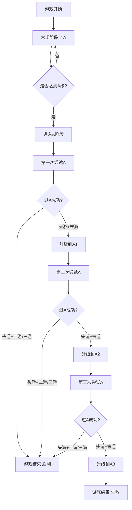

# 过A制规则说明

## 一、基本规则

每局牌从2至A，包括：**2、3、4、5、6、7、8、9、10、J、Q、K、A、A1、A2.A3仅为显示用.

### 游戏阶段
每局分两个阶段：
- **常规阶段**：即2-A阶段，按照正常升级规则进行
- **A阶段**：即过A阶段，当任何一方达到A级时进入，按照特殊过A规则进行

**重要**: A不能被越过，必打。

### 示例：
- 如一方当前比分为Q、K，获得了双上，比分显示为A，不能越过A
- 如一方当前比分为K，获得了1游3游，比分也显示为A，不能越过A

## 二、升级规则

1. **双上**（点击双上按钮）：比分+3
2. **1游3游**（点击1游3游按钮）：比分+2  
3. **1游末游**（点击1游末游按钮）：比分+1
4. 当任何一方升级到了A,A比打，实时比分显示A。到了A，即当一方的比分为A，或者两方比分都是A，即处于A阶段。
5. A阶段，升级规则是两个：一个是一次过A成功；如没一次过A成功，则升级顺序为：A-A1-A2-A3.

## 三、A阶段的完整规则

### A阶段规则总结
  **过A成功条件**：头游+二游 或 头游+三游

#### 本方处于A阶段时：第一轮A
1. **本方点击双上按钮**：头游+二游 = 成功，本方直接胜利，游戏结束，提示”恭喜某方首轮过A成功，游戏结束“。此时，界面不清空，但不能继续比赛
2. **本方点击1游3游按钮**：头游+三游 = 成功，本方直接胜利，游戏结束，提示”恭喜某方首轮过A成功，游戏结束“。此时，界面不清空，但不能继续比赛
3. **本方点击1游末游按钮**：头游+末游 = 失败，本方升级到A1，提示：“某方第一轮A未过，加油鸭！“，游戏继续
4. **对方点击任何升级按钮**：对方正常升级，本方升级到A1，提示“某方遗憾错失第一轮过A挑战“，游戏继续
5. **如对方也为A阶段**：则按A阶段升级规则执行
   点了按钮表示第一轮A结束,也即A1.

#### 特殊情况：
- **双方都到A阶段时**：按A阶段升级规则执行

#### 本方处于A2阶段时：第二轮A
1. **本方点击双上按钮**：头游+二游 = 成功，本方直接胜利，游戏结束，提示”恭喜某方第二轮过A成功，游戏结束“。此时，界面不清空，但不能继续比赛
2. **本方点击1游3游按钮**：头游+三游 = 成功，本方直接胜利，游戏结束，提示”恭喜某方第二轮过A成功，游戏结束“。此时，界面不清空，但不能继续比赛
3. **本方点击1游末游按钮**：头游+末游 = 失败，本方升级到A2，提示“某方第二轮A未过，加油鸭！“，游戏继续
4. **对方点击任何升级按钮**：对方正常升级，本方升级到A2，提示：“某方遗憾错失第一轮过A挑战“，
   点了按钮表示第二轮A结束,也即A2

#### 本方处于A3阶段时：第三轮
1. **本方点击双上按钮**：头游+二游 = 成功，本方直接胜利，游戏结束，提示”恭喜某方第三轮过A成功，游戏结束“。此时，界面不清空，但不能继续比赛
2. **本方点击1游3游按钮**：头游+三游 = 成功，本方直接胜利，游戏结束，提示”恭喜某方第三轮过A成功，游戏结束“。此时，界面不清空，但不能继续比赛
3. **本方点击1游末游按钮**：头游+末游 = 三次过A未成功，本局结束。本方实时比分显示为A3（此时将这数字2颜色改为亮黑色，待游戏结束后再恢复原来的白色）提示”非常遗憾，某方3次过A未成功，游戏结束“。此时，界面不清空，但不能继续比赛
4. **对方点击任何升级按钮**：。提示”非常遗憾，某方（即本方）虽经多次闯关，但3次过A未成功，虽败犹荣。游戏结束“。此时，界面不清空，但不能继续比赛

    点了按钮表示第3轮A结束

#### 关键点：
- **成功条件**：头游+二游 或 头游+三游
- **失败条件**：头游+末游 或 对方胜利
- **尝试次数**：只有实际打A时才计算尝试次数
- **最多3次机会**：A→A1→A2

## 四、胜负判定条件

### 胜利条件
1. **过A成功**：任何一方在A阶段成功过A（头游+二游 或 头游+三游）
2. **对方3次过A失败**：对方达到A3状态，三次过A未成功

### 失败条件
1. **3次过A失败**：本方达到A3状态，三次过A未成功
2. **对方过A成功**：对方在A阶段成功过A

### 特殊情况
1. **游戏结束状态**：游戏结束后界面不清空，但不能继续比赛
2. **每局必有胜负**：要么一方过A成功，要么一方未过A，不存在平局情况

## 五、过A制流程图

---

📝 **文档版本**: v1.0  
📅 **创建时间**: 2024年12月19日  
👤 **负责人**: Jennifer
